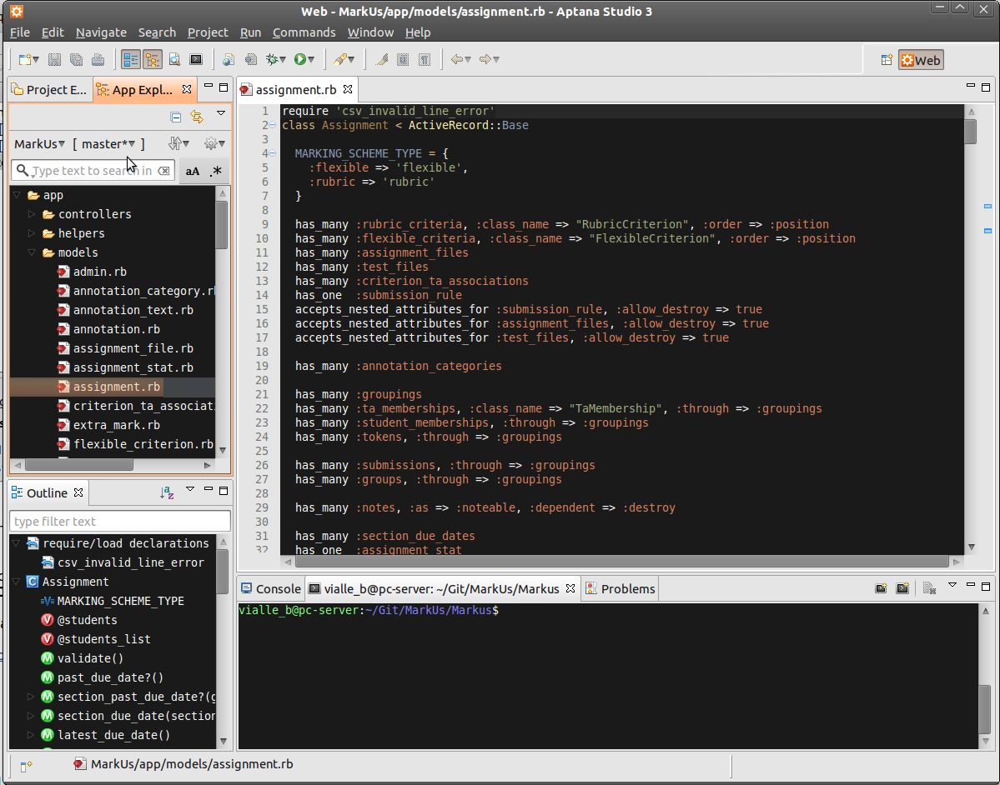
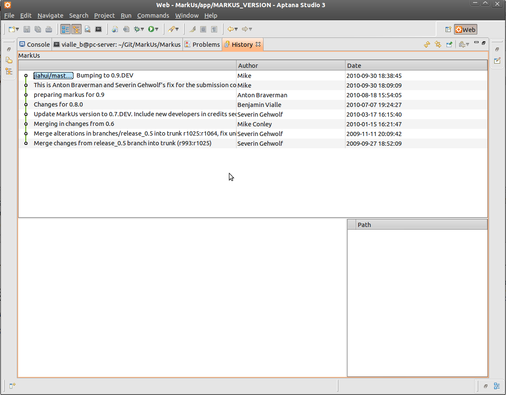
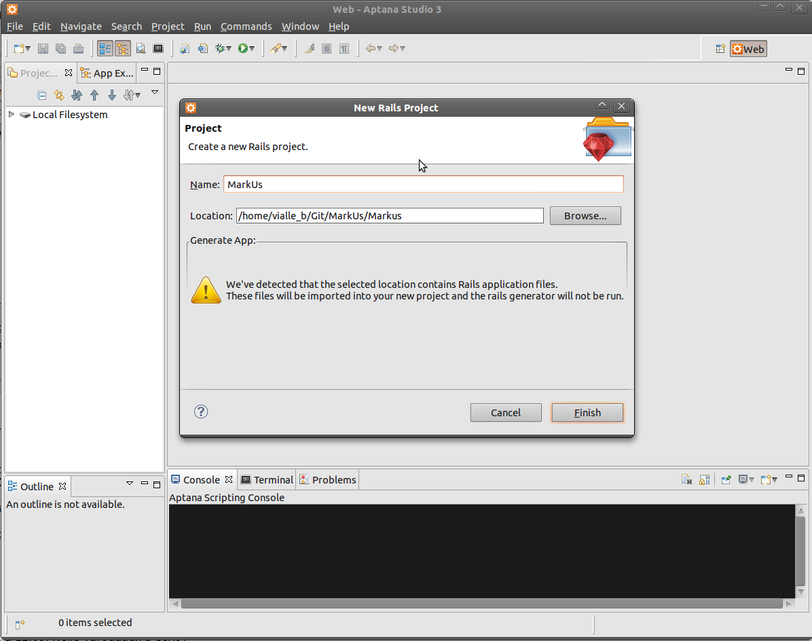

Aptana RadRails
===============

You can still install RadRails as an Eclipse plugin, but it is a bit deprecated and using standalone version is easiest

Install Aptana Radrails
-----------------------

### Standalone version

**This tutorial deals with the beta3 version of AptanaRadRails**

-   Go to [http://www.aptana.com/radrails](http://www.aptana.com/radrails) using your preferred Web browser
-   Click on "Download Now"
-   Select "Standalone" from the drop down selection menu and click on "Download Now"
-   Unzip tarball and a execute "Aptana RadRails"

### Install the Radrails Plug-in for Eclipse (optional)

This tutorial assumes that you have a working installation of Eclipse IDE (preferably Ganymede or later). After having a working Java installation this step should be pretty easy (I usually install the provided Java packages of my distribution). It is suggested to install Eclipse into one's home directory, since Eclipse's built-in plug-in installation system works most seamlessly that way. Downloading the Eclipse tar-ball (for Linux of course) and extracting it in your home directory should suffice. You may want to add the path where your eclipse executable resides to your PATH variable.

After installing Eclipse, make sure you execute the following command, otherwise you may not be able to install Eclipse plug-ins.:

    #>  apt-get install eclipse-pde

### Install Aptana Radrails

-   Start Eclipse (as normal user, *not* root)
-   Go to: “Help” - “Install New Software”
-   Click on “Add Site” (*Note:* The next 4 steps for determining the URL to enter next work as of September 15, 2009; Maybe these steps need a little adaption at some point later)
-   Go to [http://www.aptana.com/radrails](http://www.aptana.com/radrails) using your preferred Web browser
-   Click on "Download Now"
-   Select "Eclipse Plugin" from the drop down selection menu and click on "Download Now"
-   Record URL mentioned there: e.g. [http://update15.aptana.org/studio/26124](http://update15.aptana.org/studio/26124)/
-   Back in Eclipse: Enter the URL determined by the previous step
-   Select (check) “Aptana Studio” from the URL entered as "New Site" previously
-   Click "Install..." and click the “Next \>” button
-   Read the License Agreement, accept the terms, and click the “Finish \>” button.
-   When it is recommended that Eclipse be restarted click “Yes”.
-   After the restart, you will be asked to install something from Aptana Studio Site
-   Select (check) "Aptana RadRails" and click "Next \>"
-   Read the License Agreement, accept the terms, and click the “Next \>” button.
-   The downloads should be installed into the .eclipse folder in your home directory by default. If this is acceptable click the “Finish” button.
-   Wait for the downloads to complete.
-   When it is recommended that Eclipse be restarted click “Yes”.

Configuration of Aptana RadRails
--------------------------------

**Check Ruby and Rails Configuration**

If you are asked if you want to auto-install some gems it is up to you to install them or not (I did).

-   Go to "Window" - "Preferences"
-   Select "Ruby" - "Installed Interpreters"
-   The selected Ruby interpreter should be in /usr
-   Now, go to "Rails"
-   Rails should be auto-detected as well as Mongrel

### Install EGit

-   Again go to: “Help” - “Install New Software...”
-   Check if the EGit update site is available (in “Available Software Sites”. Its URL is “http://download.eclipse.org/egit/updates”.
-   If not available, click on “Add Site”
-   Enter Location: “[http://download.eclipse.org/egit/updates](http://download.eclipse.org/egit/updates)”
-   The rest of the installation should be really straight forward.
-   Check out the EGit user guide: [http://wiki.eclipse.org/EGit/User\_Guide](http://wiki.eclipse.org/EGit/User_Guide)

### Checkout MarkUs Source Code

-   Create a Github user account
-   Got to [http://github.com/MarkusProject/Markus](http://github.com/MarkusProject/Markus)
-   "Fork" the MarkUs repository, by clicking the "Fork" button.
-   Figure out the Git clone URL of your fork. Should be something like [git@github.com](mailto:git@github.com):<yourgithub-username\>/Markus.git
-   Start Eclipse and switch to the RadRails perspective
-   Clone the MarkUs repository of your Github fork (use URL as described above) as described here: [http://wiki.eclipse.org/EGit/User\_Guide\#Cloning\_Remote\_Repositories](http://wiki.eclipse.org/EGit/User_Guide#Cloning_Remote_Repositories)

