Documentation for the Administrator
===================================

*MarkUs is a web application supposed to help the grader to evaluate, mark and correct the work of students. Students don't need to print or e-mail their source code anymore. Everything is administrated by MarkUs which is as convenient as a pen to annotate the work of students. MarkUs has been created thanks to Karen Reid from the University of Toronto; this application is developed in the same time in the French engineering school “Ecole Centrale de Nantes” since 2009, especially by students who realized their internship in Toronto.*

Even if it's possible to use only one implementation of MarkUs for several teaching contents, it's however better to use one implementation of MarkUs per teaching content because it allows to limit the number of administrators and therefore prevent from interference between the different administrators.

MarkUs still doesn't manage different groups of students in the same teaching content but it will be possible very soon. It's however possible to simulate several groups of students by creating an assignment.

The purpose of this documentation is to **explain the rights reserved to the administrators.**

*It's better to connect MarkUs navigating with Firefox.*

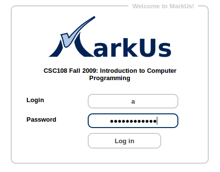

Create a new project
--------------------

Once logged in MarkUs, the administrator is welcomed in the application. **The API key is only useful if you want to connect the application by command line.**

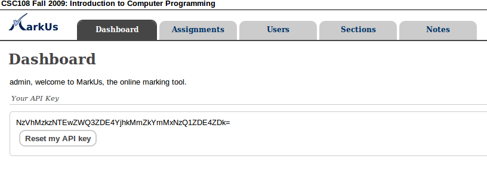

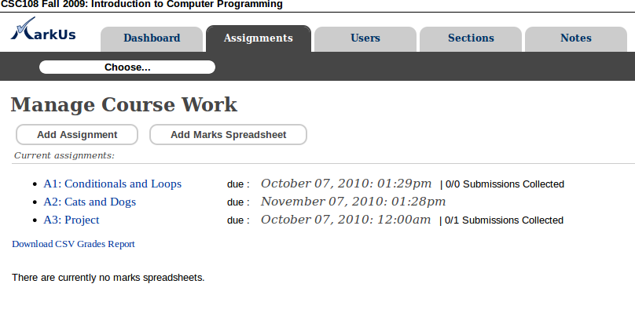

-   The deadline is chosen by the administrator and every assignment has its own deadline
-   If you want to let the students submit their work with the web interface, you need to let check “yes” in the option “Allow Web Submits”. If you check”no”, the students have to send their files by command line with Subversion.

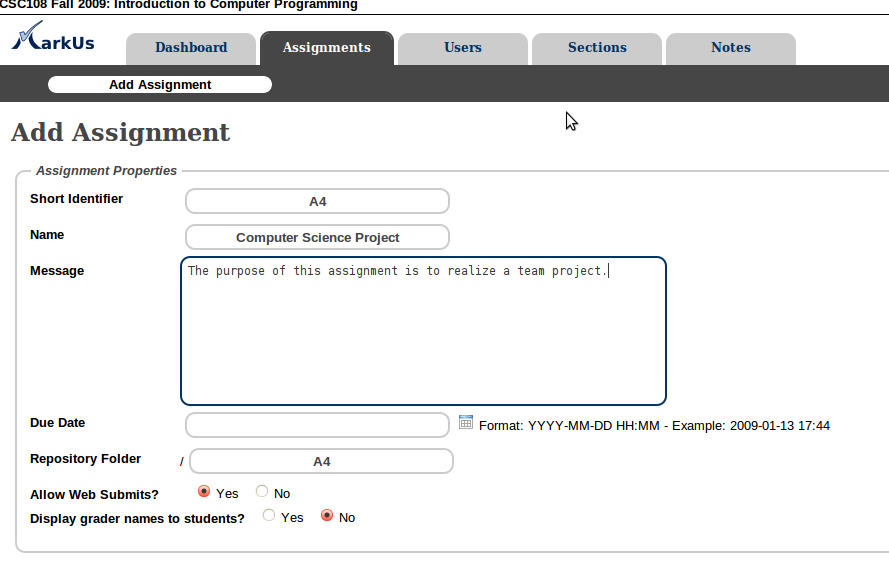

The option marking scheme allows the administrator to choose if the grader has to respect a scheme defined by the administrator (Rubric) or if the grader can define it himself(Flexible).

The Required Files allows the administrator to precise which files are required to complete the assignment. The students need to respect the names chosen by the administrator for the files. They can besides submit only one part of their work on MarkUs.

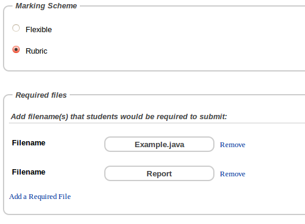

In the rubric “Assignment type”, it's possible to choose if students can work in team, or work alone and even to choose a limit number of students for a group. Eventually, the rubric “Submission rules” allow to choose the rules concerning the delays : it's possible to forbid any delay to submit the work, to deduct grace period credits or to use a penalty.

-   the first choice is strict and clear : no delay will be accepted
-   The second option consists in giving grace credits to every student at the beginning of the assignment. Every delay may implied the deduction of grace credits as long as the student have some.
-   Eventually, penalties allows to depreciate the grade of the student. The later the student submit the work, the worse will be the grade.

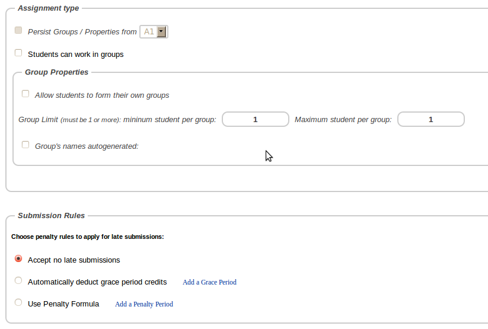

In the “Remark Request Rules” section, it's possible to choose if students can submit remark requests once their initial marks have been released. Students can continue to edit remark requests until they choose to submit to the instructor. However, they can only do so until the remark request deadline. If no deadline is specified, there will be no date restrictions on remark requests. You can also provide detailed instructions for students to follow when submitting remark requests.

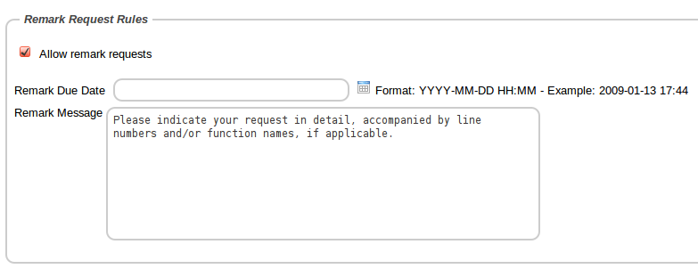

Once the assignment created, you have to define the marking scheme, and annotation models that the grader can use (of course the grader can add his own markings) and the identity of the graders for this assignment.

Define the marking scheme
-------------------------

The section “Marking Scheme” allows the administrator to define the way to evaluate the assignment. This scheme cans be used in an other assignment thanks to the tags “Upload” and “Download”. Once this scheme saved in MarkUs, it's possible to recover it in the formate CSV for save and then upload it in a new assignment.

Define annotation models
------------------------

MarkUs allows the administrator to define annotation models for graders. It's therefor possible to help graders to correct with defining models for comments and annotations that they will probably use. It's also convenient to unify the correction. Of course, graders can besides add their own comments on the work of the students .

*The annotation models are very easy to used for source code, however it's not yet possible to use it for pdf files, but it will be soon possible.*

Firstly, it's possible to recover a list of annotation models already saved to use it in another implementation of MarkUs (thanks to “Upload”). You should avoid to upload a list of annotations if some annotations have already been saved in MarkUs because the application will maybe delete the list already saved to keep the one which is uploaded. You can arrange the annotation in different categories clicking “Add Annotation Category”

Once you have created the category choose “Add annotation”, write the annotation and save it. Every grader will have access to it.

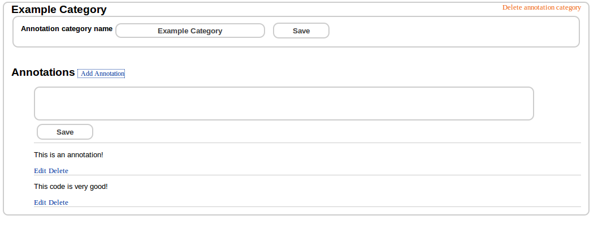

Affect students to an assignment
--------------------------------

This step is necessary to make MarkUs work well : affect students to an assignment. Firstly, you need to check that students are correctly registered in MakUs. Click “Users” and then “Students”. You can add students who are not present in this list clicking “Add new”. It's possible to save the graders list with “Download” in order to use it in another implementation (with “Upload”).You should avoid to upload a list of students if some annotations have already been saved in MarkUs because the application will maybe delete the list already saved to keep the one which is uploaded.

To affect students to an assignment you need to go back in the section “Assginements” and subsection “Groups”. It's then possible to forbid groups or to choose the list of groups able to take part in the assignment. As the students are supposed to affect themselves to their assignment, it's possible not to modify this step.

Define the graders list
-----------------------

You eventually need to define the list of graders.

Firstly, it's useful to check if all the graders have been registered in MarkUs. Choose the section “Users” and subsection “Graders”. We thus check that the list is good. You can add graders who are not present in this list clicking “Add new”. It's possible to save the graders list with “Download” in order to use it in another implementation (with “Upload”).You should avoid to upload a list of graders if some annotations have already been saved in MarkUs because the application will maybe delete the list already saved to keep the one which is uploaded.

It's possible to use several different graders in a same assignment : In the section “Graders” of the assignment concerned, you can see in the left column the list of graders registered in MarkUs and in the right column the list of groups of students and their grader. To affect a grader to a group of students, you need to select the grader in the left column and then select his group(s) of students on the right column and finally click the green arrow. We thus notice that the right column has changed with a link between the grader and the group of students selected.

To delete the link between the students and the grader you only have to click the red arrow : Once you completed this step the students can submit their files on MarkUs!

Automatic recovery
------------------

Once the deadline reached , the administrator can force the recovery of all the files submitted by the students. This option allows to obtain automatically the last submissions made before the deadline. Go to the section “Submissions”. The grader doesn't need to choose himself the revision to correct. When he wants to correct a work, he only has to follow what is described in the documentation for the grader. The grader must not launch himself the recovery of the files of students because he would lost the annotations saved.

Recover the work of a group to test on your computer
----------------------------------------------------

MakUs doesn't allow to test the files with the interface web yet but it will be possible soon. The administrator can however recover the work of a group of students to test in your computer. You have two solutions :

-   The first one consists in downloading the files you want from the annotation interface of the code. You only need to click “Download”. It's possible to recover the annotation already saved by checking “Add Annotations”. In this case, annotations will appear as comments in the code downloaded with MarkUs
-   The second solution uses Subversion. Only the administrator has this possibility. You have to go to the section “Submissions” and then export the files with SVN. It allows to download a file with the commands required to write as a command line in order to recover the files of every group of students.

Publish the evaluation
----------------------

After the works have been evaluated, there is still something to do : publish the comments made by the grader. There are two ways to do that :

-   The first way is to “unlock” in the same time the annotations of several groups of students. In the section “Submissions”, check the different submissions of which you want to publish the grades and then select “Release Marks”
-   The second way is when you are both administrator and grader in the same time : you can (in the section Annotation) to choose “complete” and directly click “release”.

Processing re-evaluation requests
---------------------------------

If students are allowed to submit remark requests for an assignment, such remark request submissions will be indicated in the "Submissions" tab. Only the instructor can process remark requests.

Although students can save and edit their remark requests multiple times, the instructor will not be notified until the student has actually decided to submit the request. Once a request has been submitted, the submission is indicated by a double-exclamation icon. Click on the group/student name to view the request.

Click on the Remark Request tab to view the request details. The instructor can write any additional overall comments regarding the request in this tab.

\*Please note that once a remark request has been submitted by the student, the student will be unable to view both the original and partially remarked results. Only after the instructor releases the grades again will results be availabe to the students.

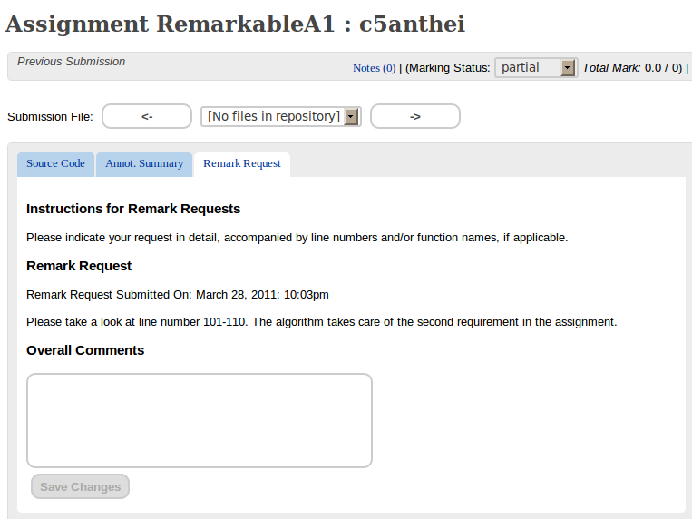

In the marks tab, the instructor can see both the old (original) marks and the new marks.

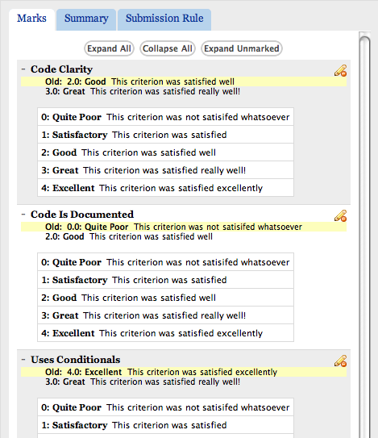

The summary tab will show the summary of new marks.

The old marks summary can be viewed upon hovering over the "Show Old Mark Summary" link.

Finally, in order to release results, the marking state needs to be changed to "Complete," and the "Released" checkbox checked off.

The students will be able to see both the old and new marks summary. Once released, the student will see a read-only version of what the instructor is able to see.

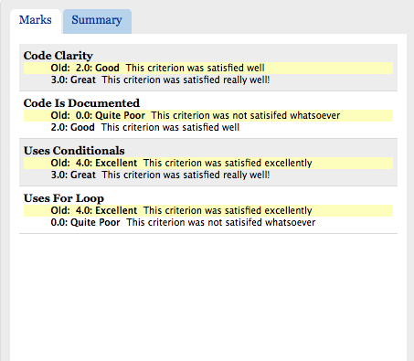