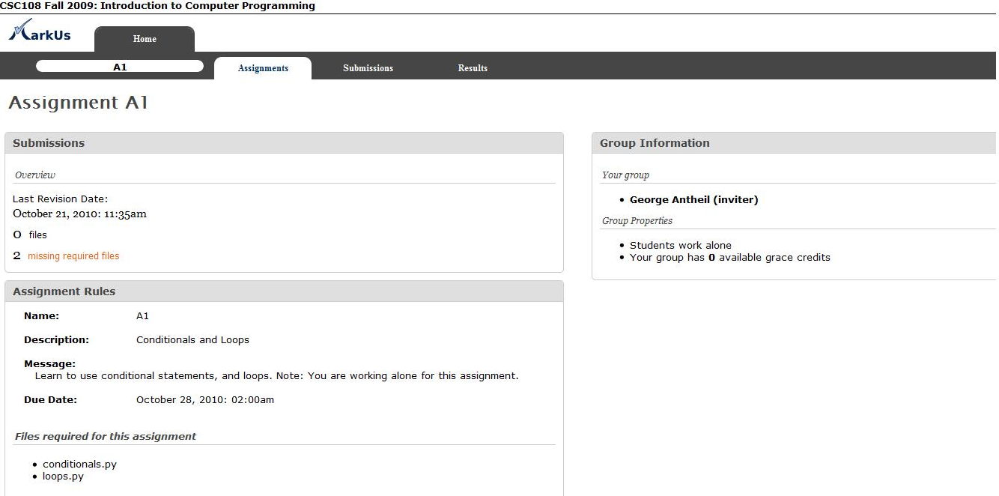
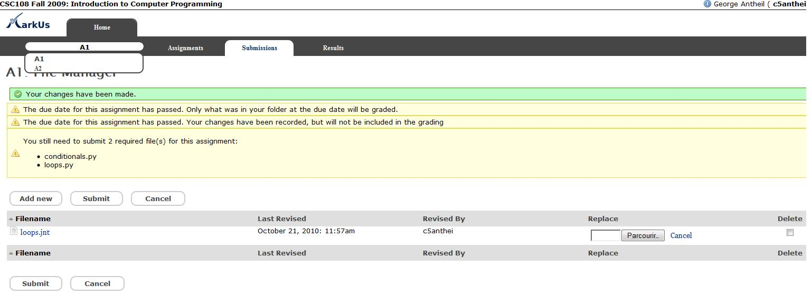
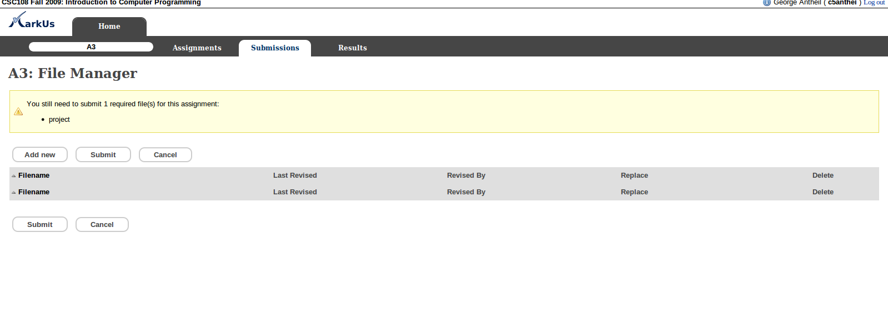
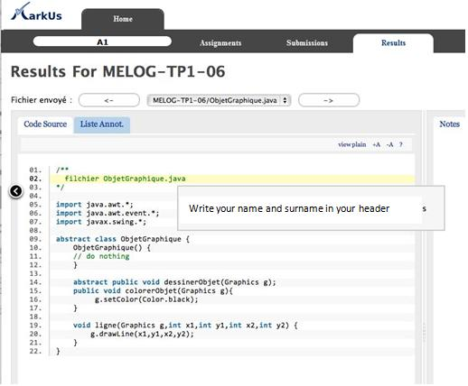
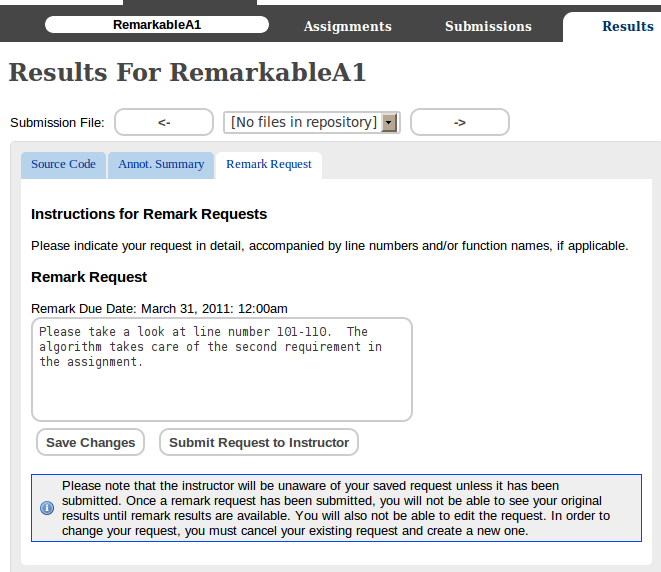
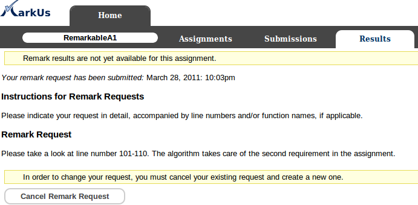
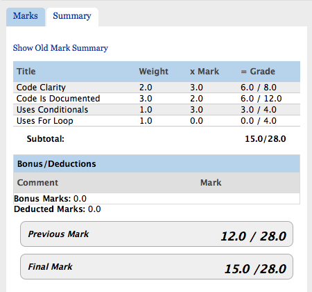
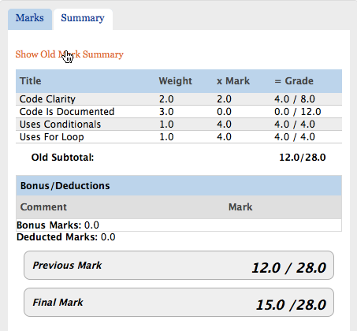

Documentation for the Student
=============================

It allows any user which is pre-registered to connect, either as a student, as a marker or as an administrator. In this post we will especially see the student rights. At this level, we describe what allows MarkUs before and after evaluation by the grader. Once connected to Markus, the student has access to the software and see the panel of various projects that he can take part in / he has already participated. This assumes that a project has been previously created and configured by the administrator / manager of material.

Submitting a homework
---------------------

From this web homepage, the student has to choose the project in which he will take part. Then a summary of the work is presented to him — especially the tasks to accomplish, and the different files to send before a specified deadline. The amount of students required for each subgroup is also clearly indicated. The student has moreover the possibility to “Work alone” or to “Create” his own subgroup:

-   In order to work alone, the student has to click on the “Work alone” link.
-   In order to work as a team member, the student has to: Click on “Create”, And give the login(s) of the other student(s) via the “Invite” link. Each invited student must connect himself on MarkUs to accept the invitation. Nevertheless, as soon as a student invited enough persons so that the subgroup is considered as valid, he can begin to send his code (in case one of the members of the subgroup shall not accept the invitation immediately). The submission will then be made well in the name of the subgroup.

Once the subgroup of pupils is constituted, new tabs appear on the screen:

-   "Send" allows to submit files;

-   "Results" will allow, later, getting back the mark and the notes left by the practical class examiner.

In order to submit the files required for the assignment, you need to choose the section «Submissions». This will open the File Manager of the assignment you want to submit your files for. This File Manager shows you not only the files you already submitted but also those one you need to send in order to complete the assignment.

In order to submit a new file, choose the tag”Add new” and then indicate the position of the file on your disk and click”Submit”. The name of the file you want to submit absolutely has to be the same that the name of the file required.

If the file has been successfully submitted it will appear in the File Manager.

Of course, if you want to modify the file you want to submit or submit a new version, it's possible using the function “Replace”.

**A submission will be taking in account in MarkUs even if all the files required have not been submitted. After the deadline, the last version of the files submitted before this date will be evaluated(it's possible to submit after).** The grader can annotate the version he wants.

Correction
----------

As we previously said, MarkUs screen allows the student to see a list of the different projects he may join/has joined. Once a project has been corrected, global appreciation is displayed (it is sometimes useful to ignore the “Mark” section, since some works has no mark for certain courses). To access the detailed results, click on “Results”. After that, the student may see the different files he submitted and, by pointing the selected text, look at the commentaries let by the teacher.

Submitting remark requests
--------------------------

If the instructor has allowed students to submit remark requests on an assignment, a "Remark Request" tab will be shown when clicking on "Results." This tab will show instructions on what the remark request should contain, as well as any due dates. Students can write their request in the text box, and choose to either "Save" (and come back later to continue editing) or "Submit."

\*It is important to note that the instructor will be unaware of any remark requests until it has been submitted. Once a remark request has been submitted, students will not be able to edit their request. Students will also be unable to view original marks until remark results have been released by the instructor.

When the student chooses to submit the remark request, the student will see a pop-up confirming the submission.

When the student clicks "Ok," the screen will change to show that the remark request has been submitted. The student will be able to see the request details. The student can also choose to cancel the remark request.

When the remarked results have been released by the instructor, the student can click on the results tab to view any comments and changes made. They will be able to see the old marks and the new marks in the marks tab.

The summary tab will show the summary of the new marks.

The old marks summary can be viewed upon hovering over the "Show Old Mark Summary" link.

