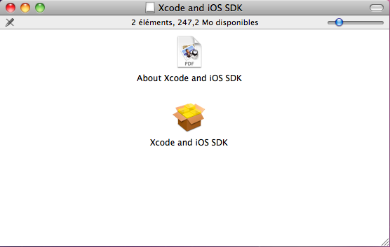
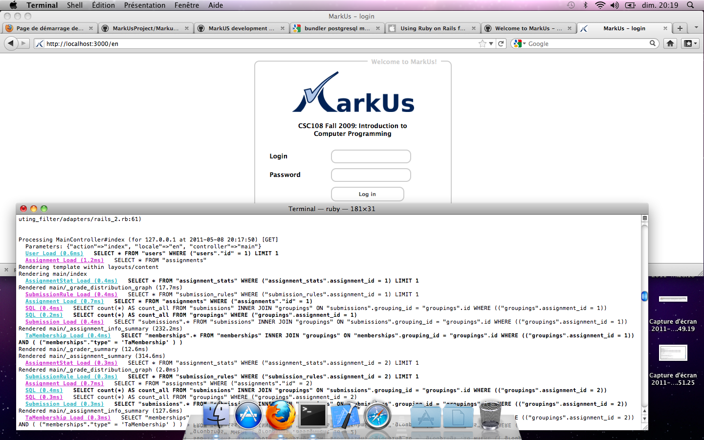

MarkUS development on Mac OS X - Snow Leopard
=============================================

*Tutorial updated September 2013, with support for Snow Leopard 10.6.8 and Snow Lion 10.8.4*

Setting up Git
--------------

Git is the Source Code Management used by MarkUs. You can find some documentation on GitHub. You will also have to set-up a GitHub account. [[How to set-up Git on Mac Os X|http://help.github.com/mac-set-up-git]]

### Download the source code

Once everything is set up and you have forked MarkUs, clone your repo:

    git clone <your_repo>

Setting up the Database
-----------------------

**Note : You can either use PostgreSQL or MySQL as database**

Once you have decided what database best suits you :

-   [[Setting up the Database (MySQL)|SettingUpMySQL]]
-   [[Setting up the Database (PostgreSQL)|SettingUpPostgreSQL]]

Setting up Xcode, RVM, Ruby on Rails, and Subversion
----------------------------------------------------

### Setting up Xcode

To correctly build some libraries, you need ruby headers. On Mac OS X, ruby-headers are provided with Xcode. Xcode 3.2.6 is only available to those with a developer account, and Xcode 4.6.x is available for free to users running the latest versions of OS X. If you're running OS X 10.7+, you'll also need the Command Line Tools package.

To download Xcode, go to [http://developer.apple.com/xcode](http://developer.apple.com/xcode)/

The package is quite big (4GB). Once downloaded, open the archive or dmg and run the installer:

### Install RVM

To manage our ruby environments, it's recommended that you download and install RVM. It can be found at: [https://rvm.io](https://rvm.io)/ or you can simply run:

    $ \curl -L https://get.rvm.io | bash -s stable

Next we'll install the latest version of Ruby 1.8.7:

    $ rvm install ruby-1.8.7
    $ rvm use ruby-1.8.7

### Subversion-rubybindings

You can download the subversion source code from: [http://subversion.tigris.org/downloads/subversion-1.6.17.tar.gz](http://subversion.tigris.org/downloads/subversion-1.6.17.tar.gz)

Once downloaded, extract the archive and cd to it:

    $ tar xvzf subversion-1.6.17.tar.gz
    $ cd subversion-1.6.17

Next, configure it for the Ruby 1.8.7 version you're using with RVM, and install it. In this case, we're using ruby-1.8.7-p374:

    $ ./configure --with-ruby-sitedir=~/.rvm/rubies/ruby-1.8.7-p374/lib/ruby \
      --prefix=`echo ~`/.rvm/rubies/ruby-1.8.7-p374 --disable-mod-activation \
      --without-apache-libexecdir

    $ make
    $ make swig-rb
    $ make install
    $ make install-swig-rb

### Setting up Rubygems

First, you will need rubygems (previously installed)

To ensure you have a good version of rubygems, please do:

    $ gem --version

If your version of rubygems is < 1.8.15, please update it ! To update Rubygems, please do:

    $ gem update --system

This section assumes, you have gem version \>= 1.8.15 (required for rails version \>= 3.0.13). MarkUs uses bundler to manage all gems. Install only bundler as a gem and bundler will install all other Gems. Make sure to install Bundler in the Ruby environment used by MarkUs.

To install bundler, run the following:

    # gem install bundler
    # PATH=$PATH:/Library/PostgreSQL/9.0/bin/:/usr/local/mysql/bin/ bundle install

Please note that bundler may ask you for your root password.

Bundle also allows some selective installation. 

To install only postgresql support, execute the following:

    $ PATH=$PATH:/Library/PostgreSQL/9.0/bin/ bundle install --without mysql

To install only mysql support, execute the following:

    $ PATH=$PATH:/usr/local/mysql/bin/ bundle install --without postgresql

As you can see, you may have to indicate to Bundler the path where PostgreSQL or MySQL were installed.

If during install you receive the following error:

    Installing mysql2 (0.2.18)
    Gem::Installer::ExtensionBuildError: ERROR: Failed to build gem native extension.

    /Users/username/.rvm/rubies/ruby-1.8.7-p374/bin/ruby extconf.rb
    checking for rb_thread_blocking_region()... no
    checking for rb_wait_for_single_fd()... no
    checking for mysql.h... no
    checking for mysql/mysql.h... no
    -----
    mysql.h is missing.  please check your installation of mysql and try again.
    -----
    *** extconf.rb failed ***
    Could not create Makefile due to some reason, probably lack of
    necessary libraries and/or headers.  Check the mkmf.log file for more
    details.  You may need configuration options.

Then at around line 120, remove the two instances of \`-Wno-null-conversion\` and \`-Wno-unused-private-field\` from \`/usr/local/mysql/bin/mysql\_config\`.

If instead, during install, you receive the following error:

    Library not loaded: libmysqlclient.18.dylib

Then try:

    sudo ln -s /usr/local/mysql/lib/libmysqlclient.18.dylib /usr/lib/libmysqlclient.18.dylib

Once installed, you will see a green message telling you everything is ready:

After installation, you can run the following to list all gems used by MarkUs:

    $ bundle exec gem list --local

    *** LOCAL GEMS ***

    abstract (1.0.0)
    actionmailer (3.0.20)
    actionpack (3.0.20)
    activemodel (3.0.20)
    activerecord (3.0.20)
    activeresource (3.0.20)
    activesupport (3.0.20)
    arel (2.0.10)
    bourne (1.5.0)
    builder (2.1.2)
    bundler (1.3.5)
    columnize (0.3.6)
    dynamic_form (1.1.4)
    erubis (2.6.6)
    exception_notification (3.0.1)
    faker (1.1.2)
    fastercsv (1.5.5)
    i18n (0.5.0)
    json (1.8.0)
    kgio (2.8.0)
    linecache (0.46)
    machinist (1.0.6)
    mail (2.2.20)
    metaclass (0.0.1)
    mime-types (1.23)
    mocha (0.14.0)
    mysql2 (0.2.18)
    polyglot (0.3.3)
    rack (1.2.8)
    rack-mount (0.6.14)
    rack-test (0.5.7)
    railroady (1.1.0)
    rails (3.0.20)
    railties (3.0.20)
    raindrops (0.11.0)
    rake (10.1.0)
    rbx-require-relative (0.0.9)
    rcov (1.0.0)
    rdoc (3.12.2)
    rghost (0.9.3)
    routing-filter (0.3.1)
    ruby-debug (0.10.4)
    ruby-debug-base (0.10.4)
    rubyzip (0.9.9)
    shoulda (3.3.0)
    shoulda-context (1.1.4)
    shoulda-matchers (1.5.6)
    thor (0.14.6)
    time-warp (1.0.13)
    treetop (1.4.14)
    tzinfo (0.3.37)
    unicorn (4.6.3)
    will_paginate (3.0.4)
    ya2yaml (0.31)

* * * * *

Create databases::

    $ bundle exec rake db:create:all     # creates all the databases defined in config/database.yml
    $ bundle exec rake db:create         # creates the database defined in config/database.yml

Next, you can execute some rake tasks to test your MarkUs installation. Sometimes, the "Rake Tasks" view doesn't work in RadRails but you can run the commands from the Terminal.

Enter the following commands:

    $ bundle exec rake db:schema:load
    $ bundle exec rake db:migrate

Next, you can load the initial database models for the current environment:

    $ bundle exec rake db:seed

Now, start the server using:

    $ bundle exec rails s

Another rake task that might be useful if you ever want to drop and recreate the database from db/schema.rb:

    $ bundle exec rake db:reset

You can learn more about other rake tasks by entering:

    $ bundle exec rake -T

You should now be able to access MarkUs at [http://localhost:3000](http://localhost:3000) in your browser.

The default admin user is 'a' with any non-empty password. Look at db/seeds.rb for other users.

**Happy Coding!**

