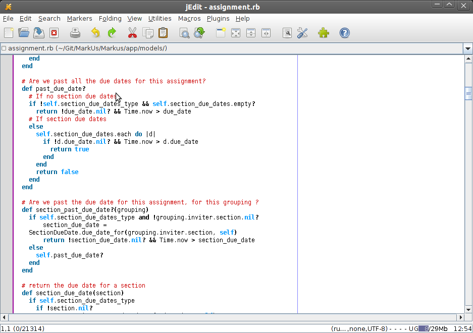

Using jEdit with Rails
======================

jEdit is a text editor for programmers, available under the GNU General Public License version 2.0. It is written in Java and runs on any operating system with Java support, including Windows, Linux, Mac OS X, and BSD.

-   After downloading and installing it, you can configure it with these settings [[jEdit for Ruby | http://www.tanguay.info/web2008/tutorial.php?idCode=rubyOnRails&sectionIdCode=configureJEditForRuby]]

To access your files, there's a File Browser System that's invisible or collapsed to the side by default. If it's not there, try:

-   Utilities \> File System Browser. There should be an option for you to dock it somewhere in the main window.

Rails 2.1.\* started naming the view files .html.erb instead of .rhtml. This caused the view files to lose its syntax highlighting. To get jEdit to recognize the new extension:

-   Utilities \> Global Options \> Editing. In the "Change settings for mode", select "rhtml".
-   Uncheck "user default settings".
-   Under File name glob, change \`*.rhtml\` to \`*.{rhtml,html.erb}\`
-   Apply

