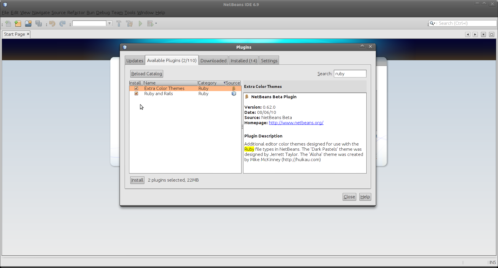
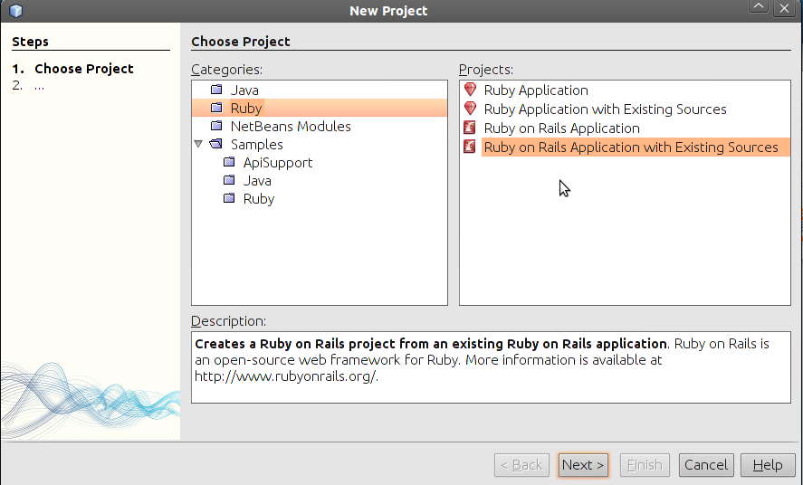
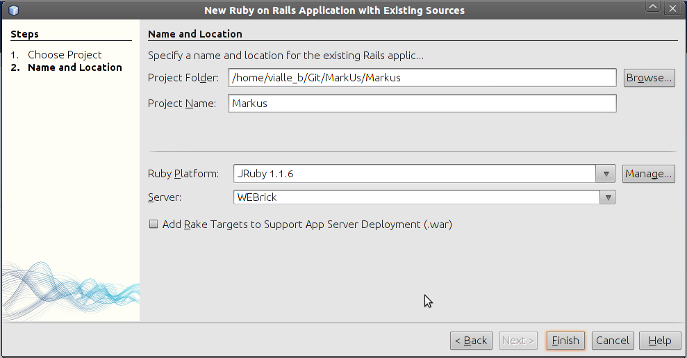
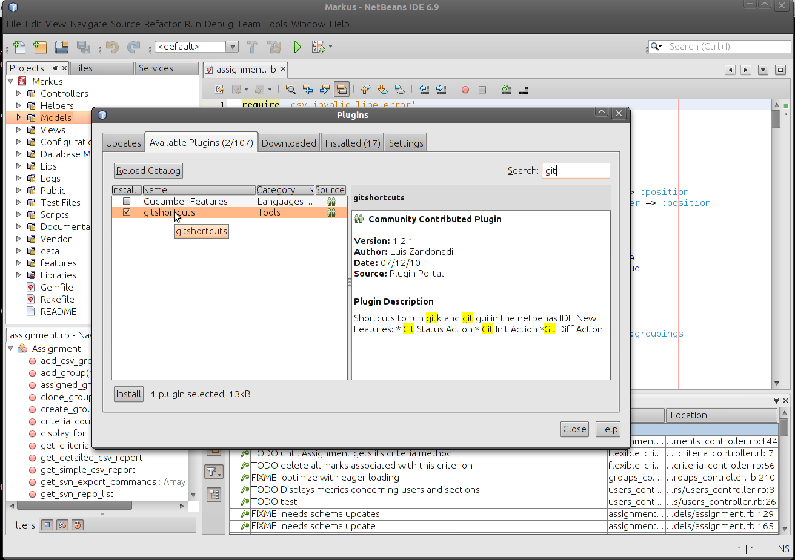

Using NetBeans with Rails
=========================

Installation
------------

Netbeans can be downloaded here : [http://netbeans.org](http://netbeans.org)/

Please check if you distribution embed Netbeans packages.

### Debian/Ubuntu

On Debian/Ubuntu, a simple

    $ apt-get install netbeans

will install netbeans.

### Gentoo

On Gentoo, use emerge

    $ emerge netbeans

Configuration
-------------

To use NetBeans with Rails, install the the Ruby and Rails plugin (from Tools\>Plugins).

In order to use it with MarkUs, choose to create a new Ruby on Rails Application from existing sources

It **was** not recommended to create a NetBeans project out of the existing MarkUs source. We used it only to edit individual files with. NetBeans used to change the configuration files you have carefully set up already, causing many things to stop working. If this happens, look in particular inside config/database.yml and restore any settings that NetBeans has changed.

Moreover, Netbeans can embed a Git plugin, to help you with source management.

**BE CAREFUL** : A graphical user interface for Git doesn't mean you don't have to understand what you do. If you don't use Git properly, you can lose data !