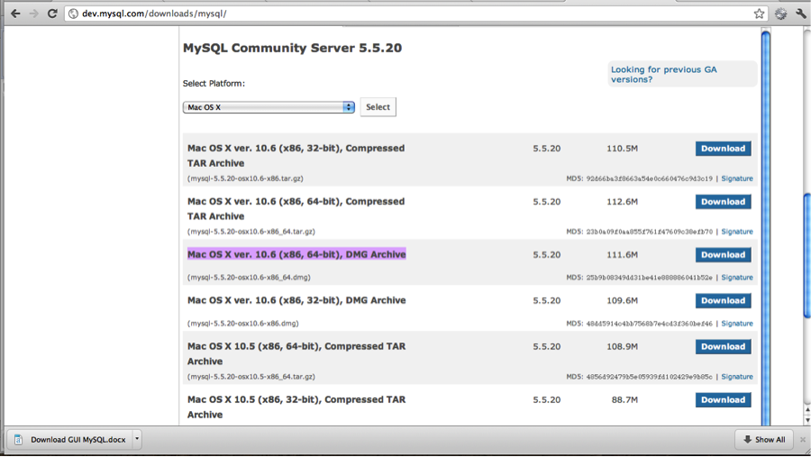
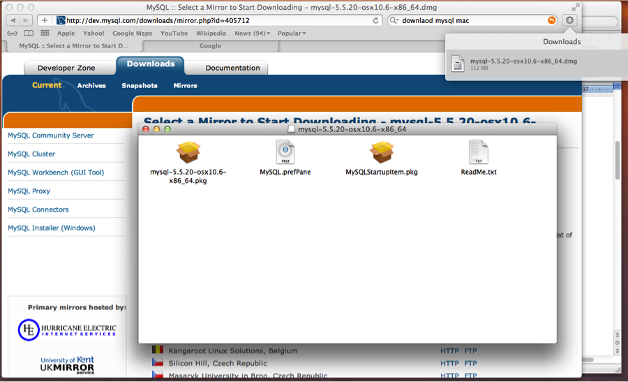
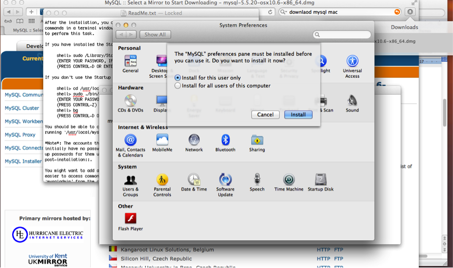
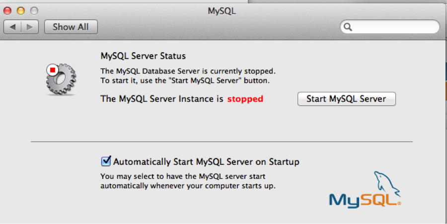

Setting up the Database (MySQL)
===============================

Installing the Database
-----------------------

### GNU/Linux

On Debian and Ubuntu, a simple

    apt-get install mysql-server libmysqlclient-dev

### Mac OS X - MySQL Installer

To install MySQL, you can use the installer from this site: [[MySQL Downloads | http://dev.mysql.com/downloads/mysql/]]

Select the MySQL for your OS. I have Mac Snow Leopard, so I selected Mac OS X ver. 10.6 (x86, 64-bit), DMG. Please select the dmg file.

In order to use the software you would have to register as a new user.

The downloading should start and the file will be saved in your “Downloads” folder. Double click on the Dmg file to start the installation.

You will get a new window as shown below:-

Run the “mysql-5.5.20-osx10.6-x86\_64.pkg” first Then run the MySQlStartupitem.pkg Then run the MySQL.prefPane

A window like this should be displayed

Install it depending on your preference.

After the installation is completed, a window like this should be displayed.

Click on Start MySQL Server, to start the server.

### Mac OS X - MySQL 5 MacPorts Installation

You can also install MySQL using MacPorts instead by following the instructions on this site: [[MySQL 5 MacPorts installation | http://www.freerobby.com/2009/09/01/installing-mysql-via-macports-on-snow-leopard-for-ruby-development/]]

After the installation is complete, you'll need to update your \`PATH\` environment variable. If you installed MySQL via the installer, add \`/usr/local/mysql/bin\` to your \`PATH\`. If you installed MySQL via MacPorts, add \`/opt/local/lib/mysql5/bin\` to your \`PATH\`.

### Microsoft Windows

Configuring MySQL
-----------------

### Creating a database user

To create a database user, enter the following commands: (In this example, the user is named 'markus', his password is 'markus', and he will be given superuser privileges. This user will be used for MarkUs later on.):

    #>mysql --user=root --password=<my password> mysql
    #>CREATE USER 'markus'@'localhost' IDENTIFIED BY 'markus';
    #>GRANT ALL PRIVILEGES ON *.* TO 'markus'@'localhost' WITH GRANT OPTION;

You can now try connecting to the server using the user you just created:

    #>mysql --user=markus --password=markus

You should see the MySQL console.

### Configuring MarkUs

Setup the database.yml file, in the MarkUs' root directory:

-   \`cp config/database.yml.mysql config/database.yml\`

-   change the usernames and password to the ones you used in the section above

-   uncomment the development and test sections of config/database.yml

Now go back to the MarkUs tutorial :

-   Installation on GNU/Linux

    -   [[Development environment|InstallationGnuLinux]]
    -   [[Production environment|InstallProdStable]]
    -   [[Old Stable (deprecated) environment|InstallProdOld]]

-   Installation on Mac OS X

    -   [[Development environment|InstallationMacOsX]]
    -   Production (need to be done)

-   Installation on Windows

    -   [[Development environment|InstallationWindows]]