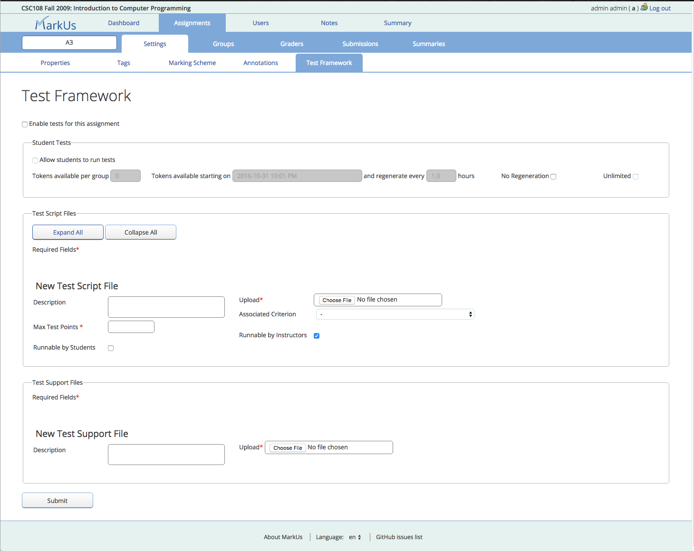
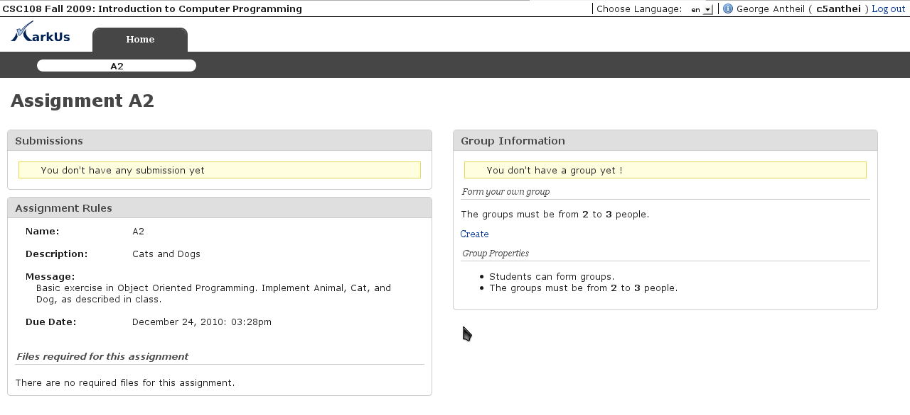

Test Framework
==============

Definition
----------

The Test Framework is a system allowing the automatic testing of students' code from inside the MarkUs web portal. The tests themselves are not run within MarkUs; instead the Framework serves as an intermediary between users and existing testing systems.

How does it work ?
------------------

Check these blog articles :

-   [http://blog.markusproject.org/?p=1561](http://blog.markusproject.org/?p=1561)
-   [http://blog.markusproject.org/?p=1634](http://blog.markusproject.org/?p=1634)
-   [http://blog.markusproject.org/?p=2198](http://blog.markusproject.org/?p=2198)

Can I use it ?
--------------

The Test Framework is still in alpha. Use it at your own risk!

How can I use it ?
------------------

The Test Framework is under active development and is not yet in the stable release of MarkUs. You will have to use the master branch of the code on GitHub to be able to test it.

### As a SysAdmin of MarkUs instance

You will need **Ant**. Install *ant* and *ant-contrib* packages on Debian/Ubuntu distributions.

In particular, if you have errors about a *for task not found*, it is because Ant has difficulties with ant-contrib. This could be a result of not using a high enough version.

### As an Administrator

The administrator can determine whether each test script is runnable by graders and/or students. Administrators are able to run all tests by default. Test scripts can be associated with a specific criterion on the assignment, and are given a total to be scored out of based on how many of the checks in the script pass. 

In order to avoid overloading the testing system during periods of high demand, student access to the test framework is controlled using **test tokens**. A student or group can run tests as many times as they have tokens. On the test framework configuration page, the administrator can decide how many tokens to allocate to each student/group (or provide unlimited tokens), determine whether tokens regenerate and how often, and decide when students can begin running tests by setting a start time for token availability.

### As a Grader

A Grader can run tests as many times as they want. Results will show up on the grading page. If tests don't run properly, graders have access to the test logs to determine problems, but do not have the ability to correct **Ant** files.

Graders will have to report to the Admin if tests do not run.

### As a Student

As mentioned above, the Student is assigned tokens for running tests. Tokens regenerate every hour by default, though this is easily adjustable by the administrator. If a group or student has remaining tokens, they do not carry over to the new period.

Writting a build.xml
--------------------

You can find some useful ressources here : [http://www.markusproject.org/dev/ant\_files.zip](http://www.markusproject.org/dev/ant_files.zip)

Ant uses a file called build.xml to construct the project. It is this file that will describe all tasks that Ant will run when running tests.

There is also a file called build.properties where we put some variable definitions.

MarkUs will create a folder where it will put students' files :

    automated_tests/group_0001/A1/
                               |
                               |-build/
                               |
                               |-lib/
                               |
                               |-parse/
                               |
                               |-reports/
                               |
                               |-src/
                               |
                               |-test/
                               |
                               
                               |-api.txt
                               |
                               |-api_helper.py
                               |
                               |-api_helper.rb
                               |
                               |-build.properties
                               |
                               |-build.xml

MarkUs will put student's files in src. MarkUs will put test files given by the Administrator in test. It will also pul librairies given by the Administrator in lib.

api\_helper.py and api\_helper.rb are two identical scripts used by Ant to return test results to MarkUs. api.txt contains the user api key. It allows api\_helper to communicate with MarkUs.

### Java

#### build.xml

#### build.properties

    #build.properties
    #Here you can add some properties for your project

    src.dir = src
    build.dir = build
    test.dir = test

    reports.dir = reports

    api_key.file = api.txt

Usage of the API Key
--------------------

# For MarkUs Developers
Below you will find detailed back-end descriptions of the Test Framework system, to help developers quickly get a handle on its structure. Certain phrases have been **bolded** that might be relevant to someone skimming the documentation looking for a specific action/behaviour. 

## Tokens
The number of tokens per period for an assignment and their associated settings are stored in fields of the assignment object. 
### As admin -> Assignment Settings -> Test Framework
This page allows an admin to **modify the token settings** for a given assignment. Each checkbox has an inline call to a function at the end of [assets/javascripts/create_assignment.js](app/assets/javascripts/creat_assignment.js) that **toggles any fields** tied to that checkbox.
Code for this form: [views/automated_tests/\_form.html.erb](app/views/automated_tests/_form.html.erb)(`line 30`). 

When this form is submitted, the fields are passed to `update`: [controllers/automated_tests_controller.rb](app/controllers/automated_tests_controller.rb)(`line 113`). Assuming there are no errors,`line 24` of this method calls `process_test_form`: [helpers/automated_tests_client_helper.rb](app/helpers/automated_tests_client_helper.rb)(`line 36`) with the assignment, form contents, and any script files as arguments. 
*(note: the `assignment_params` argument here is actually a method, defined at the bottom of the `automated_tests_controller`, which packs these paramters into one object)*. 

At the very end of `process_test_form` (`line 161`), the **assignment's token parameters are updated** with the values from the form.

### As student -> Assignment -> Austomated Testing
This is where students **spend tokens** to run tests. Code for this page: [views/automated_tests/student_interface.html.erb](app/views/automated_tests/student_interface.html.erb)

Clicking "Run Tests" calls `execute_test_run`: [controllers/automated_tests_controller.rb](app/controllers/automated_tests_controller.rb)(`line 92`), which retrieves the current user/group's tokens for the assignment through  `fetch_latest_tokens_for_grouping`: [helpers/automated_tests_client_helper.rb](app/helpers/automated_tests_client_helper.rb)(`line 10`). This method first **ensures that the current group has an associated token object**, then calls this token object's `reassign_tokens` method: [models/token.rb](app/models/token.rb)(`line 32`), which handles the DateTime math for regenerating tokens to **determine how many tokens the group should currently have**. 

If the current group has tokens remaining, `execute_test_run` calls `run_tests` (`line 109`), which in turn calls `request_a_test_run`: [helpers/automated_tests_client_helper.rb](app/helpers/automated_tests_client_helper.rb)(`line 36`), which calls `check_user_permission`(line 215), which calls the current token's `decrease_tokens`: [models/token.rb](app/models/token.rb)(`line 22`) to **decrement the number of tokens** remaining, and **makes sure the last used time is set properly**. 

### Other
Whenever any changes are made to an assignment's settings, [models/assignment.rb](app/models/assignment.rb)(`line 127`) calls `update_assigned_tokens` (`line 952`), which in turn calls the current token's `update_tokens` method: [models/token.rb](app/models/token.rb)(`line 48`), which **updates the maximum number of tokens** for student tests on that assignment. 
